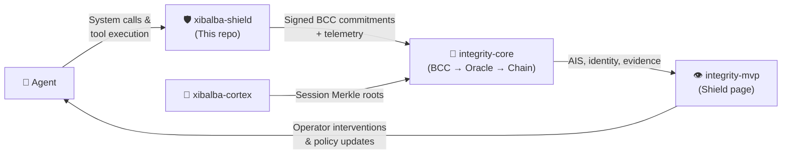
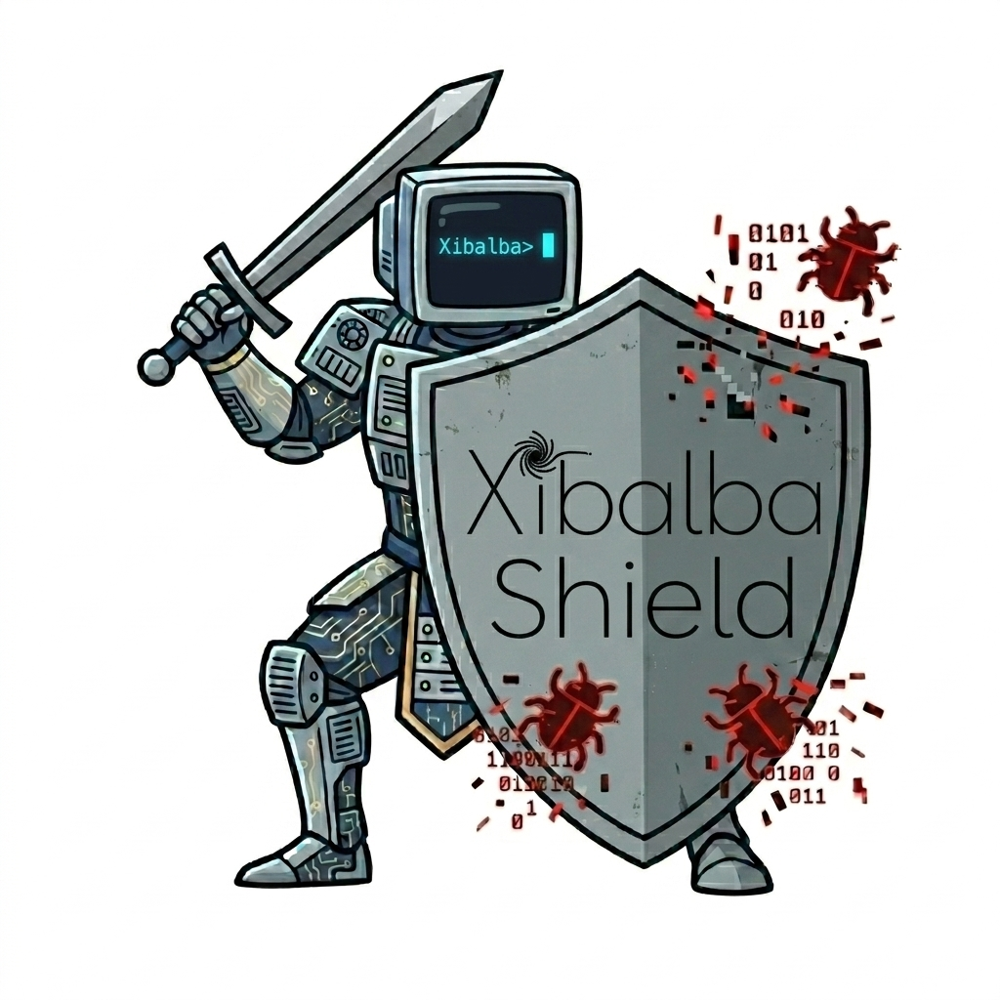
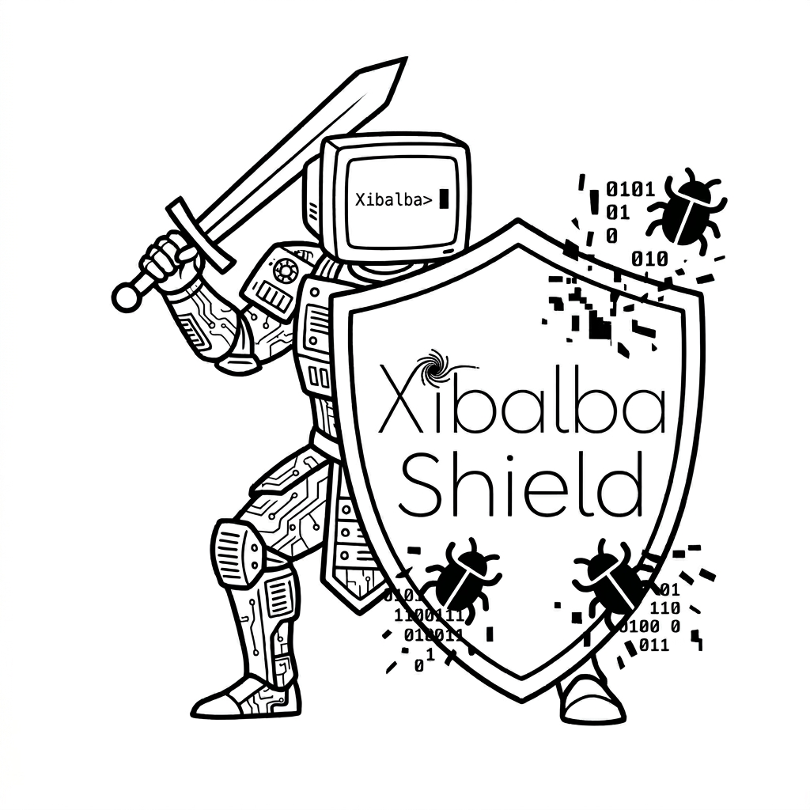
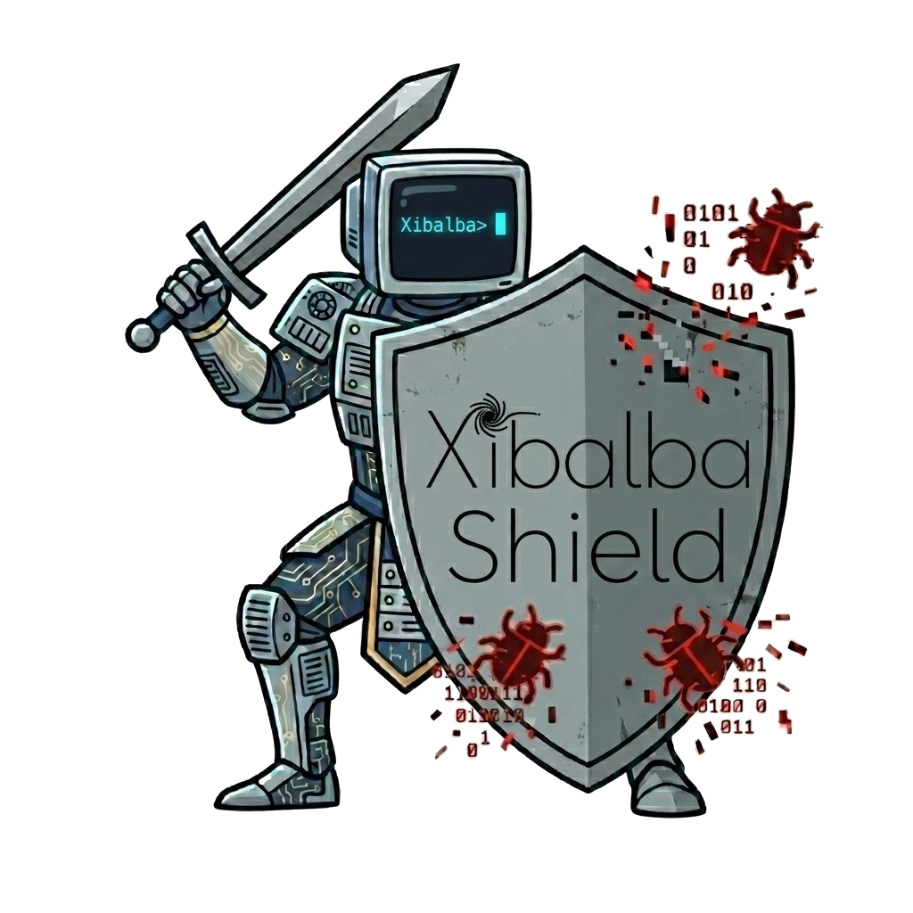
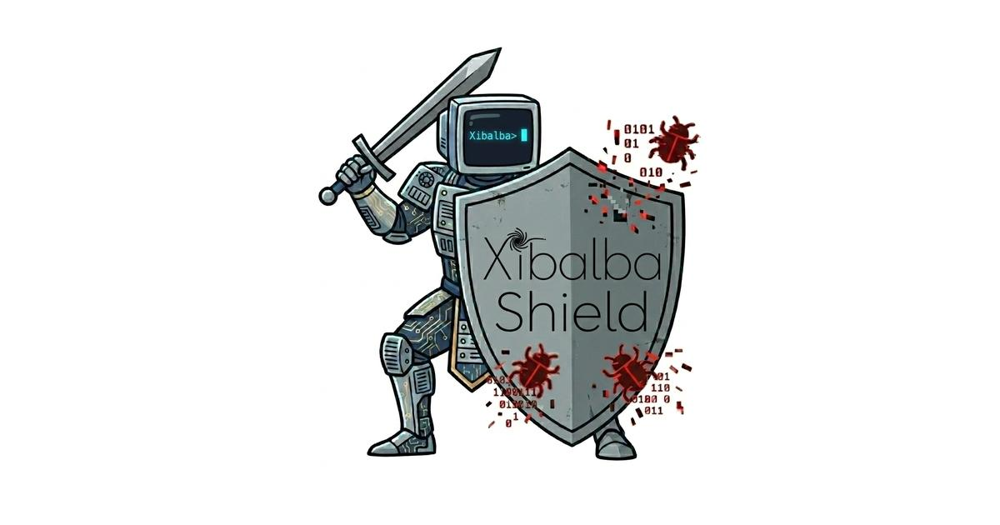
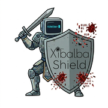
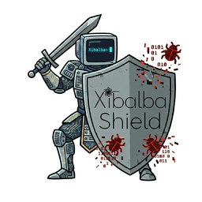
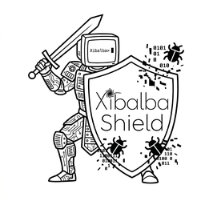

# Xibalba Shield

Xibalba Shield is a Linux-first endpoint security agent for the age of AI agents.

It is built around a simple premise: if the most powerful software now running on a vulnerable device is an agent that can plan, call tools, route to models, read data sources, write files, and open network paths, then endpoint security has to become agent-aware too. Shield fights fire with fire: it uses local agent-runtime guardrails, kernel-level telemetry, deterministic policy, and Integrity-backed evidence to constrain the agents operating on the device.

Shield is not a chatbot wrapper and not a dashboard-only compliance tool. It is the local sensor and enforcement layer. Integrity Protocol is the identity, BCC, telemetry, scoring, and evidence substrate that receives Shield's signed decisions.

## Ecosystem Role: 🛡️ The Immune System

This repository is the **immune system** in a four-project ecosystem designed as a living organism:

| Repository | Analogy | Role |
|---|---|---|
| `xibalba-cortex` | 🧠 The Brain | Local cognitive store — memories, context, reasoning provenance, session Merkle roots |
| **`xibalba-shield`** | **🛡️ The Immune System** | Endpoint enforcement, kernel sensing, policy gating, semantic guardrails |
| `integrity-core` | 🦴 The Unifying Backend | Protocol backbone — on-chain identity, BCC, Oracle scoring, smart contracts |
| `integrity-mvp` | 👁️ The Human Control Center | Operator dashboard — visualizes health, surfaces evidence, enables human intervention |

**How the Immune System connects:**
- **Inbound:** Agents route system calls and tool executions through Shield's 6 guardrail hooks. OS-level eBPF sensors observe process, file, and network activity.
- **Outbound (to Backbone):** The Integrity Exporter signs BCC commitments using `integrity-sdk` and submits signed decisions + telemetry to integrity-core's BCC middleware and Oracle, running alongside an independent OpenTelemetry span for every decision.
- **Outbound (to Control Center):** `integrity-mvp` surfaces Shield evidence, sensor status, guardrail decisions, and export status on its Shield page.



See [`integrity-core/docs/architecture/ecosystem-dependencies.md`](https://github.com/XibalbaTechSol/integrity-core/blob/main/docs/architecture/ecosystem-dependencies.md) for the canonical ownership boundaries.

## What Shield Protects

Shield is designed for the devices that are most likely to get overrun by powerful agent tooling before they get enterprise-grade security:

- SMB workstations where employees install AI tools faster than IT can inventory them.
- Professional-services laptops handling contracts, client files, credentials, and financial documents.
- Regulated desktops where an agent may touch PHI-class, confidential, or privileged workflows.
- Developer and operator machines where local tools can write files, open sockets, and automate real actions.

The goal is not to inspect every byte of content. The goal is to observe and govern behavior:

- Which process started?
- Which file path was opened for write?
- Which agent tried to call a tool?
- Which model endpoint was selected?
- Which data source entered context?
- Was the action allowed, denied, escalated, or contained?
- Was the decision exported as verifiable evidence?

Shield minimizes sensitive data by design. It records metadata, labels, hashes, and policy decisions, not raw prompts, model outputs, secrets, credentials, documents, or patient records.

## Fight Fire With Fire

Traditional endpoint tools understand processes, files, and network flows. AI agents operate one layer above that: they retrieve context, choose models, invoke tools, and take actions with semantic intent. Shield bridges both layers.

```text
AI agent / tool runtime
        |
        | guardrail hooks
        v
  ingress | retrieval/context | model routing | output | tool execution | post-action verification
        |
        v
Kernel and endpoint sensors  --->  Agent Core  --->  Policy Engine
 process exec                         |              first-match local rules
 file write-open                      |
 tcp connect                          v
                                  Local JSONL decision log
                                      |
                                      v
                           Integrity Exporter
                           DID + signed BCC commitment + telemetry
                                      |
                                      v
                           integrity-core
                           Oracle, BCC middleware, evidence, AIS
```

This gives Shield two complementary control planes:

- **OS-level sensing:** eBPF probes normalize process, file, and network activity into stable event schemas.
- **Agent-level guardrails:** library hooks let instrumented agent runtimes gate semantic boundaries before risky actions happen.

The policy engine remains local and deterministic. Enforcement does not require a cloud round trip. Export is downstream evidence propagation, not the authority that decides whether an action is allowed.

The bounded Action Broker is implemented in `shield/agent_core/action_broker.py`. It uses
resumable `SIGSTOP`/`SIGCONT` for ordinary process containment, supports explicit cgroup v2
freezing for containerized agents, and only sends `SIGKILL` from an explicit timeout escalation.
The broker does not make policy decisions; callers must supply the already-authorized action.
The verification record is [`docs/audits/2026-08-07-action-broker.md`](docs/audits/2026-08-07-action-broker.md).
Wired into the live enforcement loop as of 2026-08-12: `agent_core/router.py`'s `handle()` calls
`ActionBroker.contain()` as its very first step for any `contain` decision on a process-related
event — before any network call, so containment speed is never affected by evidence-export
latency. `shield run` constructs a real broker by default (`--no-containment` opts out).

## The Xibalba Agent: Hybrid Cascading Architecture (A2A)

While Shield’s core policy engine is deterministic and operates at machine speed to enforce rules, the **Xibalba Agent** acts as an advanced proprietary inference layer that operates alongside it. 

Rather than acting as a slow, probabilistic inline gate for every syscall, Shield employs a three-tiered **Hybrid Cascading Architecture**:

```text
Tier 1: Event stream ──→ Shield Policy Engine (Deterministic) ──→ immediate allow/deny
                             │
Tier 2:                      └──────→ Local Xibalba Agent (SLM) ──→ semantic analysis, anomaly detection
                                          │
Tier 3 (A2A Escalation):                  └──────→ Cloud Frontier Agent (LLM) ──→ deep reasoning for ambiguous threats
```

1. **Tier 1 (Deterministic Core):** Hardcoded JSON policies executed locally in microseconds for baseline known-bad behaviors.
2. **Tier 2 (Local Xibalba SLM):** A local Small Language Model (e.g., a fine-tuned sub-2B parameter model) running on-device. It analyzes semantic intent and detects zero-day anomalies without sending telemetry to the cloud.
3. **Tier 3 (Cloud Frontier Inference):** When the local SLM encounters ambiguous, high-novelty events (low confidence), it uses structured Agent-to-Agent (A2A) communication to escalate the context to a massive cloud frontier model.

For high-risk cases where contextual defense is necessary, the Action Broker pauses the suspicious local process while the SLM (or Cloud Agent via A2A) returns a structured decision. The broker validates the scope, policy, signature, and expiry of the action before Shield executes bounded actions such as:
- Terminating or pausing a process
- Revoking a specific tool capability
- Isolating a network destination or quarantining a workspace
- Escalating severity and requiring operator approval

This layered control system ensures privacy by default and reserves cloud latency/cost for the top 5% of complex evaluations, providing a proprietary, intelligent defense without making endpoint security depend exclusively on the cloud.

## Current Status

Legend: real and tested means there is code and a test or live verification path. Partial means real code exists but a named dependency or environment requirement remains.

| Area | Status | Evidence |
|---|---|---|
| Event schemas | Real and tested | `shield/schemas/events.py`, `tests/test_schemas.py` |
| Policy engine | Real and tested | Table-driven, first-match, local/offline. Supports `process`, `agent`, `file`, `flow`, `context`, and `activity` conditions. |
| Agent core | Real and tested | Registry, router, device context, event log, export-status recording. |
| Guardrail hooks | Real and tested | All six hook points exist: ingress, retrieval/context, model routing, output, tool execution, post-action verification. |
| CLI | Real and tested | `shield status`, `shield events`, `shield validate`, `shield run`, `shield fetch-policy`, `shield verify-log`, `shield siem-export`. |
| Config, policy distribution, and hot reload | Real and tested | Local JSON parsing, tenant HTTP policy fetch, atomic replace, policy version/hash, trusted policy hash pinning. |
| Integrity exporter | Real, live path — restored 2026-08-12 after a 2026-08-07 regression | Uses `integrity-sdk` DID, BCC signing, and telemetry, running alongside (not instead of) the OTel span in `agent_core/router.py`. Registration/readback scripts exist; live validation needs funded RPC/oracle credentials. |
| Dev sensor | Real and synthetic | Explicitly test/demo-only; never claimed as endpoint telemetry. |
| Linux process eBPF | Real, historically live-verified | Observed a real spawned subprocess `execve`. |
| Linux file-write eBPF | Real, historically live-verified | Observed a real write-mode `openat`; supports userspace sensitive-path filtering. |
| Linux TCP-connect eBPF | Source blocker reduced; root verification pending | `net/sock.h` include chain removed using BTF-checked minimal socket prefix. Needs root live verification before being marked verified. |
| DNS observation | Planned | Needs separate uprobe or packet-parsing design. |
| Metadata DLP classifier | Real and tested | Classifies labels, paths, data-source names, and model endpoints without storing raw content. Not a deep content scanner. |
| SIEM/SOAR export | Real and tested | JSONL normalization and generic webhook POST adapters. |
| Local tamper evidence | Real and tested | Optional HMAC hash chain for decision logs via `--log-integrity-key`; root can still delete/disable local state. |
| Windows/macOS sensors | Interface boundary only | Status helpers document ETW/EndpointSecurity target sources; native sensors need target systems. |
| Customer installer/updater | Partial | Linux install and policy-update scripts exist. Signed binary updater is still planned. |

Current root-free validation:

```text
pytest -q
Root-free tests currently pass locally; root/live-service tests skip unless their real dependencies exist.
```

Skipped tests are root-gated eBPF verification or live-stack exporter checks. They are skipped honestly; there are no fake sensor or fake Integrity-service substitutes.

## Repository Layout

```text
shield/
  agent_core/          DeviceContext, AgentRegistry, EventRouter, EventLog
  config/              JSON config loader, policy bundle hashing, hot reload
  guardrail_hooks/     Six semantic agent boundary gates
  integrity_exporter/  Integrity SDK DID, BCC signing, telemetry submission
  policy_engine/       Local deterministic rule evaluator
  schemas/             Canonical event and policy decision shapes
  sensors/             Dev sensor plus Linux eBPF probes
  integrations/        SIEM/SOAR export adapters
  cli.py               Operator CLI and runnable agent loop

policies/defaults/     SMB, professional-services, regulated policy packs
packaging/systemd/     Managed Linux service files
scripts/               E2E validation, burn-in, install/update, oracle registration helpers
docs/                  Design docs, runbooks, audits, pilot metrics
```

## Quickstart

Use a virtual environment with system packages visible if you want to run eBPF-related tests, because BCC is installed by the OS, not pip.

```bash
cd /home/xibalba/Projects/xibalba-shield
uv venv --system-site-packages .venv
uv pip install -e ".[dev]" --python .venv/bin/python
.venv/bin/python -m pytest
```

Run the local end-to-end harness:

```bash
python3 scripts/e2e_validate.py
```

The harness always runs root-free tests, validates default policy packs, runs the dev sensor through the real router/policy/log path, checks kernel BTF layout when available, and reports root/live-stack checks as `SKIP` when their real dependencies are absent.

Run a local Shield loop:

```bash
.venv/bin/shield run \
  --sensor dev \
  --device-id dev-1 \
  --rules policies/defaults/smb.json \
  --no-exporter \
  --max-events 12 \
  --dev-interval 0
```

Inspect local decisions:

```bash
.venv/bin/shield status
.venv/bin/shield events --recent 20
```

Run the Shield backend and MVP console:

```bash
.venv/bin/python -m shield.backend.api --host 127.0.0.1 --port 8765 --db-path /tmp/xibalba-shield-backend.sqlite3
```

Open:

```text
http://127.0.0.1:8765/xibalba-shield
```

Default local admin token:

```text
dev-shield-admin
```

The console has a `Seed Demo` control that creates a synthetic tenant/device scenario and labels synthetic decisions as synthetic. For API-only setup:

```bash
curl -sS -X POST http://127.0.0.1:8765/api/shield/demo/seed \
  -H 'Authorization: Bearer dev-shield-admin' \
  -H 'Content-Type: application/json' \
  -d '{"tenant_id":"demo-tenant"}'
```

Run real Linux sensors with root:

```bash
sudo .venv/bin/shield run --sensor process-exec --device-id dev-1 --no-exporter
sudo .venv/bin/shield run --sensor file-write --device-id dev-1 --no-exporter
sudo .venv/bin/python -m pytest tests/test_ebpf_sensor.py -v
```

## Policy Model

Policies are ordered JSON rule bundles. First match wins.

```json
{
  "policy_version": "regulated-2026.08",
  "rules": [
    {
      "rule_id": "regulated-deny-phi-context",
      "name": "Deny PHI-bearing data-source context",
      "version": "1.0.0",
      "conditions": [
        {"type": "context", "match": {"data_sources": ["ehr_encounter", "patient_record"]}}
      ],
      "actions": [
        {"type": "deny", "message": "PHI-bearing data source cannot be attached to this agent context."}
      ]
    }
  ]
}
```

Supported condition groups:

| Group | Matches |
|---|---|
| `process` | process name, PID, executable path, parent metadata |
| `agent` | registration state, agent ID, owner, workload metadata |
| `file` | path, name, extension, file class |
| `flow` | destination/source network tuple and direction |
| `context` | model endpoint, data sources, called tools |
| `activity` | action type, risk level, outcome, violation flag |

Supported actions:

| Action | Meaning |
|---|---|
| `allow` | Permit and record |
| `deny` | Block where pre-action enforcement exists |
| `contain` | Contain/terminate where supported |
| `log_only` | Record without enforcement |
| `escalate` | Surface for operator/future control-plane handling |

Every evaluation produces a `PolicyDecision`, including default allow/no-match decisions. Decisions include policy version/hash when loaded from a bundle and export status after the exporter is attempted.

## Default Policy Packs

Default packs live under `policies/defaults/`:

- `smb.json`: shadow AI process paths, unregistered agent tools, sensitive writes.
- `professional-services.json`: unregistered agents, unapproved model routing, client-data context.
- `regulated.json`: unregistered agents, PHI-class context, high-risk output, regulated sensitive writes.

Validate them:

```bash
python3 -m shield.cli validate --rules policies/defaults/smb.json
python3 -m shield.cli validate --rules policies/defaults/professional-services.json
python3 -m shield.cli validate --rules policies/defaults/regulated.json
```

Device configs can pin trusted policy hashes:

```json
{
  "device_id": "pilot-linux-001",
  "tenant_id": "tenant-001",
  "trusted_policy_hashes": [
    "sha256:e7101882773dbacf4af5e39f047ce8f0e8efd6843b87c1636e70ef5f0ad98939"
  ],
  "sensitive_paths": ["/home/*/.ssh/*", "/etc/*", "/var/secrets/*"]
}
```

When `trusted_policy_hashes` is non-empty, `shield run` and hot reload reject any bundle whose exact-file SHA-256 is not pinned.

Fetch a tenant policy bundle from a distribution endpoint:

```json
{
  "device_id": "pilot-linux-001",
  "tenant_id": "tenant-001",
  "tenant_policy_url": "https://tenant.example.com/shield/policy",
  "trusted_policy_hashes": []
}
```

```bash
.venv/bin/shield fetch-policy \
  --device-config /etc/xibalba-shield/device.json \
  --output /etc/xibalba-shield/policies/current.json
```

The client sends device/tenant/role headers, requires JSON, validates the bundle with the normal loader, enforces trusted hashes when pinned, and swaps the destination atomically.

The MVP backend serves the matching policy endpoint:

```text
POST /api/shield/enroll
GET  /api/shield/devices?tenant_id=...
GET  /api/shield/devices/{device_id}?tenant_id=...
POST /api/shield/policies/{tenant_id}/{device_id}
GET  /api/shield/policies/{tenant_id}/{device_id}
POST /api/shield/decisions
POST /api/shield/metrics
POST /api/shield/exporter-status
GET  /api/shield/exporter-status?tenant_id=...
POST /api/shield/integrations
GET  /api/shield/integrations?tenant_id=...
GET  /api/shield/dashboard-summary?tenant_id=...
POST /api/shield/demo/seed
```

Admin endpoints require `Authorization: Bearer $SHIELD_BACKEND_TOKEN`; local default is `dev-shield-admin`. Device ingestion endpoints require the per-device bearer token returned by enrollment.

## Guardrail Hooks

The guardrail hooks are how Shield protects agent behavior that the kernel cannot understand by itself:

- `guard_ingress`: gate request source and requesting identity.
- `guard_retrieval`: gate which data sources enter agent context.
- `guard_model_routing`: gate model/provider/endpoint selection.
- `guard_output`: gate caller-supplied risk labels before release.
- `guard_tool_call`: gate concrete tool execution intent.
- `verify_post_action`: compare expected vs actual state hash after an action.

Pre-action hooks can block. Post-action verification cannot undo an action; it records evidence and can trigger follow-on escalation.

## Metadata DLP

`shield.content_classifier.classify_metadata` gives guardrail callers a local, raw-content-free classifier for labels already known to the runtime, file paths, data-source names, and model endpoint names. It can label common cases such as `secret`, `phi`, `regulated`, and `external_model`, then pass `categories` and `risk_level` into `guard_output` or policy rules.

It is not a semantic content scanner and does not read prompt text, output text, files, or documents.

## Integrity Evidence

Shield consumes integrity-core; it does not duplicate it.

The exporter:

1. Loads or creates a DID/key identity through `integrity-sdk`.
2. Builds a signed BCC commitment with `integrity_sdk.bcc.build_bcc_commitment`.
3. Submits decisions to `bcc_middleware`.
4. Submits raw event telemetry through the public Integrity client.
5. Records export status locally so operators can see evidence gaps.

Local enforcement still happens if export fails. A local JSONL decision log is useful operational evidence, but it is not cryptographic proof until accepted and anchored through Integrity Protocol.

Run one-time registration and readback when the Integrity chain/oracle environment is available:

```bash
FUNDER_PRIVATE_KEY=... INTEGRITY_WALLET_PASSWORD=... RPC_URL=... python3 scripts/register_with_oracle.py
RPC_URL=... DEPLOYMENTS_FILE=... python3 scripts/verify_oracle_registration.py
```

## Local Tamper Evidence

For pilot hosts, store a random HMAC key in a protected path and run with:

```bash
sudo install -d -m 0700 /var/lib/xibalba-shield
openssl rand -out /var/lib/xibalba-shield/log.key 32
sudo chmod 0600 /var/lib/xibalba-shield/log.key
sudo shield --log-path /var/log/xibalba-shield/decisions.jsonl run \
  --sensor process-exec \
  --device-config /etc/xibalba-shield/device.json \
  --rules /etc/xibalba-shield/policies/current.json \
  --log-integrity-key /var/lib/xibalba-shield/log.key
```

Verify later:

```bash
shield --log-path /var/log/xibalba-shield/decisions.jsonl verify-log \
  --integrity-key /var/lib/xibalba-shield/log.key
```

This detects edits, truncation continuity breaks, and wrong-key verification. It does not stop root from deleting logs, killing Shield, or stealing the key.

## SIEM/SOAR Export

Export local decisions to JSONL for filebeat/fluent-bit/Splunk Universal Forwarder:

```bash
shield --log-path /var/log/xibalba-shield/decisions.jsonl siem-export \
  --output /var/log/xibalba-shield/siem.jsonl
```

Or POST each decision to a webhook receiver:

```bash
shield --log-path /var/log/xibalba-shield/decisions.jsonl siem-export \
  --webhook-url https://soar.example.com/xibalba-shield
```

## Linux eBPF Sensors

| Probe | Status | Notes |
|---|---|---|
| Process execution | Verified historically | kprobe on `execve`; observed real spawned subprocess. |
| File write-open | Verified historically | kprobe/kretprobe on `openat`; filters write-mode opens in kernel and sensitive paths in userspace. |
| TCP connect | Root verification pending | Uses BTF-checked minimal socket-prefix mirror to avoid the old `net/sock.h` BCC header failure. Needs `sudo pytest tests/test_ebpf_sensor.py -k tcp_connect` before verified claims. |
| DNS | Planned | Likely uprobe on `getaddrinfo` or packet parsing; not a syscall-kprobe clone. |

No eBPF sensor should be marked verified unless it is loaded as root and observes a real event on the target kernel.

## Managed Linux Service

Systemd artifacts:

- `packaging/systemd/xibalba-shield.service`
- `packaging/systemd/shield.env.example`

Runbook:

- `docs/runbooks/linux-agent.md`

The unit runs `shield run` as a supervised process, using `/etc/xibalba-shield/device.json`, `/etc/xibalba-shield/policies/current.json`, and `/var/log/xibalba-shield/decisions.jsonl`.

Helper scripts:

- `scripts/install_linux_agent.sh`: installs the package and systemd unit.
- `scripts/update_policy_bundle.sh`: fetches a tenant policy, validates it, and reloads/restarts the service.
- `scripts/burn_in.py`: records root-free throughput, CPU/RSS, decision mix, and the fact that false-positive rates require operator-labeled pilot data.

## E2E Validation

Local validation:

```bash
python3 scripts/e2e_validate.py
```

With live `bcc_middleware`:

```bash
cd /home/xibalba/Projects/integrity-core
docker compose up -d --wait postgres redis opa oracle-backend bcc-middleware
cd /home/xibalba/Projects/xibalba-shield
python3 scripts/e2e_validate.py --bcc-url http://localhost:8000
```

With root eBPF verification:

```bash
sudo python3 scripts/e2e_validate.py
sudo python3 scripts/verify_tcp_connect_root.py > artifacts/tcp-connect-root.json
```

For pilot and commit-readiness review, collect the real target artifacts and summarize the gates:

```bash
python3 scripts/pilot_gate_report.py \
  --tcp-artifact artifacts/tcp-connect-root.json \
  --did-artifact artifacts/did-readback.json \
  --windows-artifact artifacts/windows-native-sensors.json \
  --macos-artifact artifacts/macos-native-sensors.json \
  --burn-in-artifact artifacts/burn-in.json \
  --hardening-attestation artifacts/os-hardening-attestation.txt \
  --installer-attestation artifacts/installer-attestation.txt
```

No local script can close root-only, live RPC/oracle, native Windows/macOS, OS hardening, signed installer, or multi-day workload gates without those real target artifacts. Missing artifacts report `BLOCKED`, not pass.

Known e2e caveat in this workspace: the current global Python environment has an editable `integrity_sdk` from `/home/xibalba/Projects/INTEGRITY/integrity-sdk`, not this repo's pinned `integrity-core` dependency. Live exporter validation should be run from a clean virtual environment installed with `uv pip install -e ".[dev]" --python .venv/bin/python`.

## Security Posture

Read `SECURITY.md` before representing Shield capabilities to a customer, pilot, or auditor.

Important boundaries:

- Shield defaults to allow when no rule matches; policy authors decide what to block.
- Guardrail hooks only protect instrumented agent runtimes that call them.
- Root on the endpoint can disable or tamper with local Shield state.
- Local logs can be HMAC-chain tamper-evident when configured, but they are not a substitute for Integrity-anchored evidence.
- Shield does not compute AIS; Integrity Oracle owns scoring.
- Shield is not a full EDR/XDR replacement in v1.
- Shield is not a HIPAA product by itself; regulated deployments require separate operational and contractual controls.

## Documentation Map

| Document | Purpose |
|---|---|
| `SPECIFICATION.md` | Normative Shield product and implementation specification |
| `SECURITY.md` | Threat model, security posture, limitations |
| `IMPLEMENTATION_PLAN.md` | Living implementation ledger |
| `docs/audits/2026-08-06-status.md` | Current audit/status record |
| `docs/design/signed-policy-bundles.md` | Signed policy bundle design and local hash-pin enforcement |
| `docs/pilot-acceptance-metrics.md` | Pilot gates for resource use, false positives, export success, operator usability |
| `docs/runbooks/linux-agent.md` | Install, diagnose, rollback, uninstall |
| `shield/sensors/ebpf/README.md` | eBPF verification and blocker record |

## Remaining Work

Highest-priority gaps:

- Run root live verification for TCP-connect eBPF on the target kernel and archive `scripts/verify_tcp_connect_root.py` JSON output.
- Register the Shield exporter DID with Integrity Oracle and archive live `GET /v1/agent/{did}` or registry readback evidence.
- Verify exported Shield decisions through the intended Integrity evidence/audit surface.
- Run multi-day burn-in with real workloads: false positive review, CPU/RAM, eBPF overhead, and export reliability.
- Design and implement DNS observation.
- Build a signed binary/package updater with rollback and staged rollout, then record artifact hash/signature/service-manager/rollback attestation.
- Implement Windows/macOS native sensors when target platforms are available and archive platform-native validation artifacts.

## License

MIT. See `LICENSE`.

## Assets

The following visual assets have been generated for branding and website deployment, located in the `assets/` directory:

| Preview | Asset | File | Description |
|---------|-------|------|-------------|
|  | **Color Logo** | `assets/xibalba_shield_logo_color.jpg` | Primary full-color shield logo |
|  | **B&W Logo** | `assets/xibalba_shield_logo_bw.jpg` | Black & white line-art logo |
|  | **Transparent Logo** | `assets/logo_transparent.png` | Color logo with transparent background |
|  | **Swirl Icon** | `assets/xibalba_swirl_logo.png` | Standalone cropped swirl icon |
|  | **Open Graph Image** | `assets/og_image.jpg` | 1200x630 social share preview card |
|  | **Apple Touch Icon** | `assets/apple_touch_icon.png` | 180x180 iOS home screen icon |
|  | **Color Banner** | `assets/banner_color.jpg` | 1920x1080 16:9 color website banner |
|  | **B&W Banner** | `assets/banner_bw.jpg` | 1920x1080 16:9 B&W website banner |
|  | **Color Favicons** | `assets/favicon_color.png` | Standard browser favicons |
|  | **B&W Favicons** | `assets/favicon_bw.png` | Black & white browser favicons |
