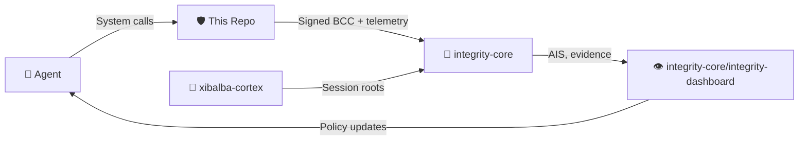

# Xibalba Shield Specification

**Version:** 1.0 implementation specification
**Status:** normative for the xibalba-shield repository
**Updated:** 2026-08-12
**Owner:** Xibalba Solutions

Xibalba Shield is an endpoint security agent for discovering AI agents and tools, constraining risky behavior, and exporting verifiable evidence into Integrity Protocol. Shield is the endpoint sensor and local enforcer. Integrity Protocol is the identity, BCC, telemetry, scoring, and evidence substrate. Shield consumes Integrity; it does not duplicate it.

**Shield is a standalone product.** It senses, decides, and contains locally with zero cloud
round-trip; that core loop requires no other repository or account to function. Integrity
Protocol integration (signed evidence export, SIEM/SOAR forwarding) is additive value, not a
dependency the enforcement loop needs. §2 below describes the ecosystem role without implying
that role is required for Shield to work.

This specification defines what Shield must do, how the current repository is organized, which interfaces are stable, and which gaps remain. The implementation status ledger remains [README.md](README.md); this document defines the target behavior and module contracts.

## Current audit and implementation boundary

The current audit status is [`docs/audits/2026-08-06-status.md`](docs/audits/2026-08-06-status.md), corrected by later update notes at the top of that file. The root-free suite reports **138 tests passed, 9 skipped** (2026-08-21; grew from 103/7 after ActionBroker, Tier-2 `SlmBackend`, Rego-profile, and CLI wiring tests landed). Historical repository evidence records Linux process-exec and file-write eBPF verification; the audit did not reproduce live eBPF/exporter verification and TCP-connect remains blocked. Two closed since the 2026-08-06 audit boundary: the Integrity Exporter (deleted 2026-08-07, restored 2026-08-12, see `docs/archive/2026-08/IMPLEMENTATION_PLAN.md`) and the Action Broker (existed but was never called from `shield run`'s live loop; wired 2026-08-12). This specification is normative for behavior, but README, the archived implementation plan, SECURITY, and the audit ledger determine observed implementation status.

## 1. Source Of Truth And Scope

### 1.1 Normative Documents

| Document | Authority |
|---|---|
| [SPECIFICATION.md](SPECIFICATION.md) | Shield product behavior, module contracts, event semantics, local enforcement model, and roadmap scope. |
| [README.md](README.md) | Current implementation status, verification evidence, commands, and plan. |
| [SECURITY.md](SECURITY.md) | Implemented security posture, threat model, disclosure handling, and current limitations. |
| [shield/sensors/ebpf/README.md](shield/sensors/ebpf/README.md) | Linux eBPF verification record and TCP-connect blocker details. |
| [Wiki](../../wiki) (`docs/wiki/`) | Architecture concept pages, ecosystem role, compliance evidence trail — a core set, not exhaustive. |
| integrity-core spec/integrity-protocol-v0.4.md | Protocol primitives consumed by Shield: DID, BCC, telemetry, AIS, Merkle anchoring, delegation, and evidence exports. |
| integrity-core spec/xibalba-shield-v1.md | Protocol-facing companion boundary for Shield. |

### 1.2 Product Scope

Shield v1 is:

- An endpoint agent for AI-agent discovery and policy enforcement.
- A local policy decision engine that can operate without a cloud round trip.
- A producer of signed evidence for Integrity Protocol.
- A guardrail hook library for semantic agent/LLM boundaries.
- A Linux-first security agent with verified process and file-write sensing, and a blocked TCP-connect sensor pending BCC/kernel compatibility work.

Shield v1 is not:

- A reputation backend or AIS scoring engine.
- A Merkle anchoring service.
- A full EDR/XDR replacement.
- A content-inspection or DLP system.
- A payment rail, custodial key service, or settlement system.
- A HIPAA healthcare product; Integrity Health is the healthcare vertical.

## 2. Ecosystem Role: 🛡️ The Immune System

Shield is a standalone product first: `shield run` senses, decides via the local policy engine,
and contains via the real Action Broker, entirely offline, with no Integrity Protocol account or
network dependency in that loop. What follows describes how Shield's evidence *additionally*
flows into the broader Integrity Protocol ecosystem when configured to — not a requirement for
Shield's core enforcement behavior.

This repository is the immune system in a three-repository ecosystem designed as a living
organism. (`integrity-dashboard` — the operator presentation layer, previously developed as a
separate `integrity-mvp` repository — now lives inside `integrity-core` as a component, not a
fourth sibling repository.)

- **🧠 The Brain** (`xibalba-cortex`): The agent's cognitive store — memories, context, reasoning provenance, session Merkle roots.
- **🛡️ The Immune System** (`xibalba-shield`, this repo): Endpoint enforcement, kernel sensing, policy gating, semantic guardrails. Detects threats and produces verifiable evidence.
- **🦴 The Unifying Backend + 👁️ Control Center** (`integrity-core`): The protocol backbone — on-chain identity, BCC, Oracle scoring, smart contracts, ZK circuits — plus `integrity-dashboard/`, the operator presentation layer that visualizes health and surfaces evidence.



### 2.1 Dependency Direction

The dependency graph is one-way: xibalba-shield depends on integrity-core public interfaces. integrity-core must never import Shield code or rely on Shield for correctness. A Shield sensor failure must not alter AIS computation, BCC canonicalization, Merkle batching, chain schemas, or protocol anchoring.

### 2.2 Evidence Flow

1. Sensor or guardrail hook observes an event.
2. Agent Core normalizes the event and attaches device/agent context.
3. Policy Engine evaluates ordered rules.
4. Event Router records a local PolicyDecision.
5. Integrity Exporter signs a BCC commitment using integrity-sdk.
6. The commitment and telemetry are submitted to integrity-core services.
7. Integrity services score, anchor, and expose evidence through their own surfaces.

### 2.3 Enforcement Boundary

Shield enforcement is local. Integrity evidence is remote and verifiable. If export fails, local enforcement still happens and local decision logging still records the outcome. Export failure must be visible, retried when possible, and never silently converted into proof.

## 3. Architecture

### 3.1 Runtime Model

Shield v1 runs as one lightweight endpoint process composed of internal modules rather than a mesh of local services. Runtime modules:

- shield.sensors: OS and synthetic event sources.
- shield.agent_core: registry, router, device context, event log.
- shield.policy_engine: ordered rule evaluation.
- shield.guardrail_hooks: semantic agent/LLM boundary gates.
- shield.integrity_exporter: BCC signing and telemetry submission.
- shield.config: local config loading and policy hot reload.
- shield.cli: operator commands and executable agent loop.

### 3.2 Resource Budget

| Resource | Budget |
|---|---:|
| Resident memory | <= 90 MB |
| Sustained CPU | <= 3-5% on a typical endpoint |
| Hot-path network dependence | none for enforcement |
| Local persistence | append-only JSONL decision log plus minimal DID/key material |

### 3.3 Failure Philosophy

- Local policy enforcement must continue without cloud access.
- Export failures must not reverse an already-made local decision.
- Guardrail exceptions must be logged and surfaced; they must not be hidden as successful policy evaluation.
- Malformed policy bundles must be rejected as a whole, with the last-known-good policy retained.
- No module may claim to be verified unless a test or live run exercises the real dependency.

### 3.4 Hybrid Cascading Architecture (A2A)

Shield employs a three-tiered cascading architecture to balance machine-speed enforcement, privacy, and advanced reasoning:
- **Tier 1 (Deterministic Core, real):** Local OPA/Rego policy evaluation for baseline known-bad
  behaviors — see §7.5 for the current OPA-sidecar dependency.
- **Tier 2 (Local Xibalba SLM, real inference / demo-stage integration):** A local Small Language
  Model analyzes semantic intent and detects zero-day anomalies without sending telemetry to the
  cloud. The `SlmBackend` contract is normative below (§3.4.2); the MVP model is off-the-shelf
  (Qwen2.5-0.5B-Instruct), not purpose-built — see §3.4.3.
- **Tier 3 (Cloud Frontier Inference, `[PLANNED]`):** No code exists yet. Structured Agent-to-Agent
  (A2A) escalation is designed conceptually here but not implemented.

Tier 1 evaluates every event. A Tier-2 backend, when configured, is consulted **only** for events
Tier 1 already decided `escalate` — it is never the first evaluator an event sees, and Tier 1's
decision vocabulary (`allow`/`deny`/`contain`/`log_only`/`escalate`) is exactly what Tier 2 must
also produce, so a Tier-2 decision is a drop-in replacement for the `escalate` outcome, not a
parallel authority. The Action Broker acts on whichever tier's decision is final; it never
distinguishes which tier decided.

### 3.4.1 SLM Optimization and Constraints

Because the Tier 2 Local Xibalba SLM is strictly constrained to structural event routing and does not require general conversational capabilities, it must be aggressively optimized for enterprise hardware (sub-500M parameters, <1GB RAM):
- **Grammar-Constrained Inference:** The inference engine (`llama.cpp`, via `llama-cpp-python`) must enforce strict JSON schema grammar constraints during generation. This eliminates the need for the model to learn JSON syntax, dedicating all parameters to security reasoning. Real and working today in `slm_training/app.py` and `LocalSlmBackend` (§3.4.2).
- **Few-Shot Prompting (MVP approach):** Instead of immediate fine-tuning, the SLM uses a tightly constrained system prompt with curated examples of telemetry-to-JSON routing. This allows off-the-shelf sub-1B instruct models (Qwen2.5-0.5B today) to function out of the box.
- **Task-Specific Fine-Tuning (Future Optimization, needs community resources):** For production deployment, the model can be hyper-specialized on the Shield Event schema and Action Broker JSON outputs. `slm_training/train.py` implements this (QLoRA), but requires an NVIDIA GPU this development environment doesn't have — no fine-tune has been run yet. See README.md's "Community: help build Tier 2" for what contribution is needed.
- **Vocabulary Pruning:** Unused tokens (e.g., conversational text, formatting) should be mathematically pruned from the model weights to physically reduce the binary size and memory footprint. `[PLANNED]` — not implemented.

### 3.4.2 SlmBackend Contract (normative)

`shield/agent_core/slm_backend.py` defines the Tier-2 interface, matching `PolicyEngine.evaluate()`'s
exact signature so a backend is interchangeable at the call site:

```python
class SlmBackend(Protocol):
    def evaluate(self, event: NormalizedEvent, ctx: EvaluationContext) -> PolicyDecision: ...
```

Two implementations exist:

- **`SimulatedSlmBackend`** — deterministic, keyword-pattern-based, explicitly labeled synthetic
  in every decision's `reason` field. Exists so the Tier-2 escalation path is testable in CI
  without a model file. Not a stand-in for real semantic judgment; it is a testing tool.
- **`LocalSlmBackend`** — thin wrapper around real grammar-constrained Qwen2.5-0.5B inference
  (same system prompt and JSON schema as `slm_training/app.py`'s demo, reimplemented rather than
  imported to avoid that module's import-time side effects — root requirement, real eBPF sensor
  load, Flask app construction). Optional dependency (`llama-cpp-python` + a local model file);
  raises `RuntimeError` with an actionable message if either is missing, rather than silently
  falling back to another tier.

`EventRouter` accepts an optional `slm_backend: SlmBackend | None = None`. `None` (the CLI default,
`--slm-backend none`) preserves pre-2026-08-12 behavior exactly — the Tier-2 code path is never
entered. A backend raising an exception must never take down the router; the router falls back to
Tier 1's original decision and logs the failure loudly.

### 3.4.3 Community Dependency (explicit, not implied)

Shield does not build a production-grade Tier-2 model from scratch, and this specification does
not claim it will. The plan is to use an appropriate off-the-shelf/community small language model
(Qwen2.5-0.5B is the current MVP choice, not a permanent commitment) and rely on community
contribution for the resource-intensive parts: synthetic (or appropriately licensed real) training
data at meaningfully greater diversity than the current ~950-row template-generated set, and
GPU/inference compute to actually run `slm_training/train.py` and iterate. Tier 3 (§3.4, cloud A2A
escalation) is entirely `[PLANNED]` and has no code; it is out of scope until Tier 2 has enough
real-world signal to define what "ambiguous" means in practice.

## 4. Event Model

### 4.1 Common Requirements

All Shield event records must include enough information to support policy decisions, local audit, and Integrity-backed evidence without capturing raw protected content.

Required principles:

- Preserve canonical field names from shield.schemas.events.
- Use class as the event class key.
- Include time, device_id, and enough event-specific context for policy conditions.
- Do not include raw prompt text, file contents, model output contents, secrets, credentials, patient identifiers, or private documents.
- Prefer opaque IDs, hashes, labels, and resource classes over sensitive payloads.

### 4.2 Event Classes

| Class | Purpose | Current implementation |
|---|---|---|
| process_activity | Process launch/exit and lineage. | ProcessActivity, Linux process-exec sensor verified. |
| file_activity | File create/open/write metadata. | FileActivity, Linux write-open sensor verified. |
| network_flow | Host-attributed outbound flow metadata. | Schema exists; TCP sensor blocked by BCC/kernel version skew. |
| agent_event | Semantic agent/LLM boundary activity. | Guardrail hooks emit/evaluate this shape. |
| policy_decision | Every policy evaluation result. | Router/event log/exporter use this as primary decision evidence. |

### 4.3 PolicyDecision Requirements

Every policy evaluation, including allow and log-only outcomes, must produce a decision record with original event reference, rule reference if matched, final action, operator-readable reason, severity, timestamp, device context, and canonical UUID `invocation_id`. An instrumented agent event preserves its upstream invocation ID; an endpoint-only observation receives a new ID. The identifier follows `integrity-core/spec/invocation-id-v1.md` and provides correlation, not proof of execution or authorization.

## 5. Sensor Specification

### 5.1 Sensor Interface

A sensor is any object satisfying the Sensor protocol in shield/sensors/base.py. It produces an iterator of normalized event objects. The Event Router must not depend on concrete sensor internals.

### 5.2 Dev Sensor

The dev sensor generates synthetic events for local testing, demos, and CLI workflow validation. It must always be labeled synthetic and must never be represented as real endpoint telemetry.

### 5.3 Linux eBPF Sensors

| Probe | Target | Required output | Status |
|---|---|---|---|
| Process execution | execve | PID, process name, executable path, UID/GID when available. | Verified. |
| File write-open | openat write mode | PID, process name, path, operation class. | Verified; userspace sensitive-path glob filtering is config-loadable. |
| TCP connect | tcp_v4_connect | PID/process, destination IP/port, protocol, direction. | Code exists; blocked at compile on current BCC/kernel stack. |
| DNS observation | uprobe or packet parsing design TBD | Query name and resolved IPs without payload capture. | Planned. |

Kernel programs must do the least possible work in kernel space and send compact records to userspace. Any field-offset workaround must be verified against the target kernel BTF or an equivalent reliable source before being treated as real telemetry.

### 5.4 Windows And macOS Sensors

Windows/macOS support is post-Linux. Future sensors must normalize into the same event classes so Agent Core, Policy Engine, Exporter, and CLI remain platform-agnostic.

## 6. Agent Core Specification

### 6.1 DeviceContext

Device context identifies the endpoint and policy scope: device_id, tenant_id, device_role, operating system, and optional posture fields as future extensions.

### 6.2 AgentRegistry

The registry tracks observed agents, tools, and model/API workloads. An agent absent from the registry is treated as unregistered for policy purposes. Registry entries should capture agent/workload ID, display name, type, owner, declared purpose, authority level, and registration state.

### 6.3 EventRouter

The router receives events, attaches context, evaluates policy, invokes applicable guardrail gates, appends local decision logs, submits evidence to the exporter when configured, and returns a decision to the caller. Router behavior must remain deterministic for a given event, registry state, and rule list.

### 6.4 EventLog

The local event log is JSONL used by shield status and shield events. It records policy version/hash when a policy bundle is loaded and export status after export attempts. When configured with an HMAC key, entries must include a verifiable hash chain for local tamper evidence. Local tamper evidence is still host-bound and does not replace Integrity-exported, off-device evidence.

## 7. Policy Engine Specification

### 7.0 Current Evaluation Path (corrected 2026-08-12)

`shield/policy_engine/engine.py`'s `PolicyEngine.evaluate()` delegates rule evaluation to a local
OPA (Open Policy Agent) REST server (default `http://localhost:8181`, package path
`/v1/data/shield/policy`), not an in-process JSON-bundle matcher — this changed 2026-08-07
(commit `f86c0f0`) and is the tested, intended current behavior (`tests/test_policy_engine.py`
mocks the OPA call directly). §7.1–§7.3 below describe the **rule schema and condition/action
vocabulary** — this remains the authoring format JSON bundles use and the shape a Rego policy
must implement — but the JSON bundle's parsed `rules` content is **not itself consulted** by
`evaluate()` today; only `policy_version`/`policy_hash` metadata is. All three default packs have
real Rego translations under `shield/policies/rego/` and must be loaded as isolated selected profiles;
`shield local-run --profile {smb,professional-services,regulated}` supervises that local smoke
path. Plain `shield run` still expects an operator-managed local OPA sidecar. If OPA is
unreachable, `evaluate()` fails closed (`deny`) — never a silent allow, matching
`bcc_middleware`'s own documented posture in `integrity-core`.

### 7.1 Rule Model

Rules are JSON records parsed into PolicyRule: rule_id, name, version, scope, conditions, actions, and optional ais_impact hint. The policy engine evaluates rules in list order. First match wins. (Applies to the Rego translation's authored behavior — see §7.0 for what's actually consulted at runtime today.)

### 7.2 Condition Groups

| Group | Matches |
|---|---|
| process | process name/path/PID/user metadata |
| agent | agent registration, authority, owner, workload metadata |
| file | file path/name/extension/type |
| flow | destination/source network tuple and direction |
| context | model endpoint, data sources, tools called |
| activity | activity type, risk level, outcome, policy violation flag |

Unknown fields must not silently match. Path-like values may use glob matching where implemented.

### 7.3 Actions

| Action | Meaning |
|---|---|
| allow | Permit and record. |
| deny | Block the action where pre-action enforcement exists. |
| contain | Contain/terminate process or workload where supported. |
| log_only | Record without enforcement. |
| escalate | Surface to operator or future control plane. |

### 7.4 AIS Impact

ais_impact is a future scoring hint only. Shield must not compute AIS, persist AIS deltas as authoritative, or call private scoring internals. Integrity Oracle remains the only scoring authority.

## 8. Guardrail Hook Specification

Guardrail hooks wrap semantic AI/agent boundaries that OS sensors cannot understand.

| Hook | Timing | Purpose |
|---|---|---|
| Ingress | pre-action | Gate prompt/request source and requesting identity without storing prompt text. |
| Retrieval/context | pre-action | Gate which data sources are added to context. |
| Model routing | pre-action | Gate model/provider/endpoint selection. |
| Output | pre-release | Gate caller-supplied classification labels and risk categories; does not classify content itself. |
| Tool execution | pre-action | Gate concrete tool call/action intent. |
| Post-action verification | post-action | Compare expected vs actual state hash; detect semantic-physical gap. |

Pre-action hooks may block. Post-action verification cannot undo an action; it can only produce evidence, raise, and trigger follow-on containment/escalation.

## 9. Integrity Export Specification

### 9.1 Exporter Responsibilities

The exporter must load or create DID/key identity through integrity-sdk, convert PolicyDecision records into BCC commitments, use integrity_sdk.bcc.build_bcc_commitment for commitment shape/signing, submit telemetry through the public Integrity client, and treat export as best-effort evidence propagation rather than local enforcement authority.

### 9.2 Security Intent Namespace

| Intent type | Meaning |
|---|---|
| shadow_agent_detected | Unregistered agent/tool discovered. |
| agent_contained | Agent process/workload contained or terminated. |
| connection_blocked | Outbound connection denied. |
| guardrail_denied | Agent/LLM boundary action denied. |
| phi_access_attempt | PHI-bearing resource access attempted. |
| device_posture_change | Device risk posture crossed a policy threshold. |

### 9.3 Export Failure Semantics

Export failures must be logged and visible in local decision records. Local enforcement must not roll back. Retries must be bounded by queue/backpressure controls and must not consume unbounded memory. A local JSONL record without Integrity export is not cryptographic evidence.

## 10. Configuration And Update Specification

Current v1 implementation supports local JSON files for policy rules and device config. It must parse the whole file before replacing live policy, reject malformed bundles as a whole, keep last-known-good policy on reload failure, surface failures through logs/CLI, enforce trusted policy hashes when configured, and attach operator-visible policy version/hash to decisions when rules come from a bundle. The signed policy bundle design is [`docs/design/signed-policy-bundles.md`](docs/design/signed-policy-bundles.md).

Policy hot reload is mtime-polled and intentionally simple. Future file watchers may replace polling only if they preserve last-known-good semantics.

Tenant policy distribution is implemented as a client-side HTTP(S) fetch, validate, trusted-hash check, and atomic local replace. The hosted policy service contract is outside this repository. Code auto-update requires verified downloads, signature checking, staged rollout, rollback, and explicit operator recovery design before implementation.

## 11. CLI And Operator Surface

| Command | Purpose |
|---|---|
| shield status | Summarize local decision log and agent state. |
| shield events --recent N | Show recent local policy decisions. |
| shield validate | Validate policy and device config files. |
| shield run | Run sensor -> router -> policy -> log/exporter loop. |
| shield fetch-policy | Fetch, validate, and atomically install a tenant policy bundle. |
| shield verify-log | Verify the optional local HMAC decision-log hash chain. |
| shield siem-export | Export local decision logs to JSONL or a generic webhook. |

The CLI must fail with clean errors and no Python traceback for expected operational failures such as non-root eBPF startup. Repository validation scripts must report unavailable root, live RPC/oracle, native OS, signing, hardening, and burn-in evidence as blocked rather than substituting local mocks.

## 11.1 Backend MVP API

The backend MVP is a tenant control plane for demos and pilots. It must not become the local enforcement authority; endpoint allow/deny decisions remain local. Its minimum API surface is enrollment, device inventory, policy distribution, decision ingestion, burn-in metrics ingestion, exporter status, integration configuration, dashboard summary, and synthetic demo seeding with explicit synthetic labels.

The backend stores tenant/device state, policy bundles, decision summaries, metrics, exporter status, and SIEM/SOAR integration config in SQLite for the MVP. Production hosting may replace SQLite only if tenant isolation, device-token authentication, and policy-fetch compatibility are preserved.

## 11.2 Detection Quality Metrics

Shield must use Integrity Protocol for verifiable detection-quality measurement, not for inline
attack detection. The local enforcement loop remains authoritative for endpoint decisions.
Integrity receives signed decisions, event telemetry, policy hashes, export status, and explicit
labels so downstream reports can reproduce quality metrics.

The canonical v1 metric is Shield ADR: `true_positive_security_decisions /
labeled_malicious_events`. A true positive is a labeled malicious event for which Shield returned
`deny`, `contain`, or a justified `escalate`. Companion metrics are blocking false-positive rate,
precision, mean time to contain, and evidence export success.

Any customer-facing metric must identify event ID, device ID, tenant ID, policy version/hash,
decision action, rule ID, export status, Integrity receipt when available, label, and label
source. Synthetic labels are valid for CI and demos only; pilot claims require real pilot-window,
benchmark, or red-team labels. Shield must not compute AIS or any authoritative security score
locally; Integrity Oracle/reporting may derive rollups from Shield evidence.

The Shield backend's detection-quality report must distinguish raw labeled metrics from
receipt-backed metrics. Receipt-backed ADR requires BCC middleware `/v1/bcc/verify_token` success
for each ADR-counted security decision. When an Oracle URL is supplied, the report also checks
`/v1/audit-log` for BCC intercept audit readback, but the BCC verification token remains the
cryptographic approval receipt.

## 12. Privacy, Data Minimization, And Regulated Environments

Shield follows behavioral telemetry only.

Allowed telemetry includes process metadata, file path/classification metadata, network tuple metadata, agent/workload metadata, model endpoint labels, data-source class labels, risk category labels, and hashes of expected/actual state where needed.

Forbidden telemetry unless a later spec explicitly changes the boundary: raw prompt text, raw model output, file contents, credentials, secrets, patient identifiers, payment credentials, and private documents.

In regulated environments, Shield must tag PHI-bearing resources by class and access event, not inspect records. The built metadata classifier may derive labels from supplied categories, paths, data-source names, and model endpoints only. Any deployment involving ePHI requires separate contractual and operational controls; this repository does not itself create HIPAA compliance.

## 13. Security Model

### 13.1 Trust Assumptions

- Endpoint administrator/root can disable or tamper with local Shield state.
- Integrity-exported evidence becomes tamper-evident only after accepted by Integrity services and anchored according to protocol rules.
- Local JSONL logs are operational records; optional HMAC hash chaining is host-bound tamper evidence, not off-device proof.
- Policy files are trusted local configuration once loaded; tenant distribution must preserve trusted-hash enforcement.

### 13.2 Threats Addressed

- Shadow AI process or tool discovery.
- Unauthorized model/tool execution.
- Risky data-source attachment to agent context.
- Policy-relevant outbound network attempts where sensor support exists.
- Evidence gaps where an agent acts but produces no durable audit record.

### 13.3 Threats Not Fully Addressed In v1

- Root-level attacker on the same endpoint.
- Kernel tampering or BPF subsystem compromise.
- Full packet inspection and DNS attribution.
- Content exfiltration detection by payload inspection.
- Windows/macOS endpoint parity.
- Automatic remediation beyond implemented deny/contain hooks.

## 14. Compliance Reporting

Shield does not own a separate compliance export path. Compliance reporting must compose through Integrity Protocol evidence exports so the customer sees one evidence chain instead of parallel logs.

Minimum future report dimensions: device ID and tenant, agent/workload identity, policy version/hash, event class, action/decision, reason and severity, BCC commitment ID/token, anchor/receipt link when available, and export status/gaps.

Compliance reports that claim detection quality must also include labeled-event denominators,
label source, Shield ADR, blocking false-positive rate, precision, mean time to contain when
containment is claimed, BCC verification-token proof status, optional Oracle audit-log readback,
and enough Integrity receipt data to reproduce the metric from evidence.

## 15. Testing And Verification

A Shield capability is real only when pure logic is covered by deterministic unit tests, CLI behavior is covered by subprocess/argparse-level tests, integration behavior reaches a real service or self-skips honestly when unavailable, eBPF behavior is verified under root against real kernel probes, or documentation states the blocker and does not imply capability.

Current test families are listed in [README.md](README.md). New modules must add tests scaled to risk and update both README status and this specification when behavior changes.

## 16. Roadmap

Goals and milestones framed for compliance/audit use (finance, healthcare verticals) are in
README.md's "Goals and Milestones" section; this roadmap is the implementation-phase breakdown.

### Phase 1: Linux Enforcement Baseline

- Complete process execution sensor.
- Complete file write sensor.
- Unblock TCP-connect sensor through BCC/kernel compatibility or verified BTF-based struct handling.
- Design DNS observation separately.
- Keep sensitive-path file-event filtering config-loadable and covered by root-free tests.

### Phase 2: Integrity Registration And Evidence Closure

- Register Shield exporter DID with Oracle.
- Verify agent lookup/readback for Shield exporter identity.
- Verify audit-log query for exported Shield events.
- Re-run resource budget with registered DID and clean exporter queue.
- Add evidence-export examples once integrity-core reporting surface is ready.

### Phase 2.5: Policy Engine Completeness

- Keep all three default Rego translations (`smb`, `professional-services`, `regulated`) covered
  by interpreter-backed regression tests.
- Keep `shield local-run --profile ...` as the supervised selected-profile smoke path; plain
  `shield run` continues to require an operator-managed OPA sidecar.
- Grow the Tier-2 SFT dataset and run a real fine-tune, with community help (§3.4.3) — needs GPU/
  inference compute this project does not have alone.

### Phase 3: Policy Distribution And Update Safety

- Keep signed policy bundle format and local trusted-hash enforcement aligned.
- Keep tenant policy distribution client covered against a real HTTP server contract.
- Specify safe code update mechanism with signature verification and rollback.

### Phase 4: Pilot Readiness

- Package install flow.
- Default policy packs for SMB/professional-services/regulated environments.
- Operator runbook.
- Incident-response workflow.
- Resource and stability burn-in.

### Phase 5: Platform Expansion

- Windows ETW sensor.
- macOS endpoint sensor.
- Optional network appliance/container sensor.
- SIEM/SOAR integrations beyond JSONL/webhook baselines.

## 17. Acceptance Criteria For v1 Pilot

A Shield v1 pilot is ready when Linux process and file sensors are verified on target pilot kernels; TCP-connect is either verified or explicitly removed from pilot claims; shield run works as a managed service or supervised process; policy rules can be validated and hot-reloaded; local decision logs are inspectable by CLI; exporter reaches live BCC middleware with a registered DID; README status, SECURITY posture, and this specification agree; and a rollback/uninstall procedure exists.

Pilot measurement gates are defined in [`docs/pilot-acceptance-metrics.md`](docs/pilot-acceptance-metrics.md).

## 18. Revision Policy

Additive clarification may remain v1.0. Any breaking event schema change, policy rule shape change, exporter commitment semantic change, or source-of-truth transfer requires v2 or an explicit migration note. Implementation gaps must be marked as planned, partial, blocked, or verified; silent aspirational claims are not allowed.

*End of specification.*
