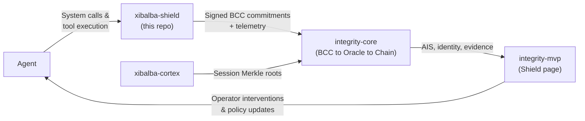

## Table of contents

- [Overview](#overview)
- [How the Immune System connects](#how-the-immune-system-connects)
- [Repository boundary](#repository-boundary)
- [Related pages](#related-pages)

## Overview

Xibalba Shield is one of four projects in a living-organism-shaped ecosystem, described in
`README.md`'s "Ecosystem Role" section. Shield is **🛡️ The Immune System**:

| Repository | Analogy | Role |
|---|---|---|
| `xibalba-cortex` | 🧠 The Brain | Local cognitive store — memories, context, reasoning provenance, session Merkle roots |
| **`xibalba-shield`** | **🛡️ The Immune System** | Endpoint enforcement, kernel sensing, policy gating, semantic guardrails |
| `integrity-core` | 🦴 The Unifying Backend | Protocol backbone — on-chain identity, BCC, Oracle scoring, smart contracts |
| `integrity-mvp` | 👁️ The Human Control Center | Operator dashboard — visualizes health, surfaces evidence, enables human intervention |

## How the Immune System connects

- **Inbound.** Agents route system calls and tool executions through Shield's six
  [Guardrail Hooks](../concepts/guardrail-hooks.md) (when an instrumented runtime calls them).
  OS-level eBPF [sensors](../concepts/sensor-model.md) observe process, file, and network
  activity independently of that.
- **Outbound, to the Backbone.** The [Integrity Exporter](../concepts/integrity-exporter.md)
  signs BCC commitments using `integrity-sdk` and submits signed decisions plus telemetry to
  `integrity-core`'s BCC middleware and Oracle, running alongside an independent OpenTelemetry
  span for every decision — see [Event Router](../concepts/event-router.md).
- **Outbound, to the Control Center.** `integrity-mvp` surfaces Shield evidence, sensor status,
  guardrail decisions, and export status on its Shield page (a consumer of Shield's exported
  data, not documented in this wiki — see `integrity-mvp`'s own repository).

## Repository boundary

Shield consumes `integrity-sdk` as a one-way dependency, the same way any third-party agent
runtime would — no privileged API, no special-cased access. `integrity-core` has zero dependency
back onto this repository in either direction. That boundary is the entire reason the split
exists: a kernel-sensor bug in Shield must never be able to affect AIS computation or Merkle
conventions in the parent protocol.

## Related pages

- [xibalba-cortex ecosystem role](https://github.com/XibalbaTechSol/xibalba-cortex/wiki/ecosystem-role)
- `integrity-core`'s
  [`docs/architecture/ecosystem-dependencies.md`](https://github.com/XibalbaTechSol/integrity-core/blob/main/docs/architecture/ecosystem-dependencies.md)
  for the canonical cross-repository ownership boundaries
- [Enforcement Pipeline](enforcement-pipeline.md) — what happens inside the Immune System box
