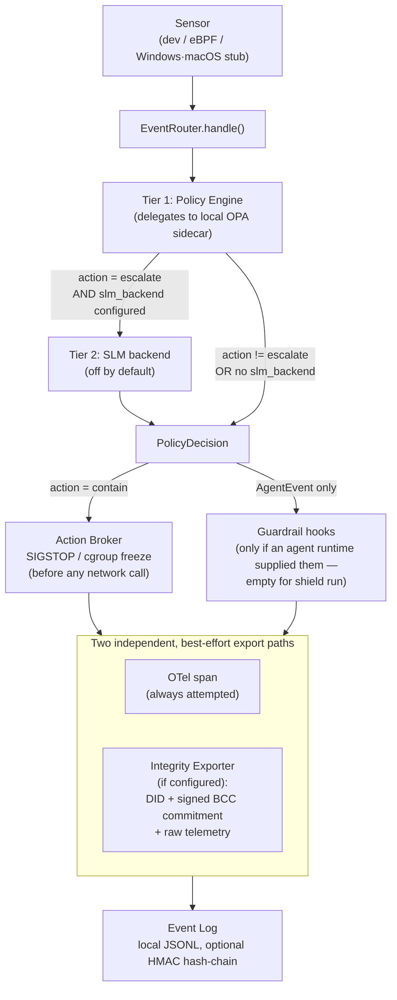

## Table of contents

- [Overview](#overview)
- [Step by step](#step-by-step)
- [Related pages](#related-pages)

## Overview

This is the single place that ties [Event Router](../concepts/event-router.md),
[Policy Engine](../concepts/policy-engine.md), [Action Broker](../concepts/action-broker.md), and
[Integrity Exporter](../concepts/integrity-exporter.md) together end to end — one normalized
event, in, to one logged, exported `PolicyDecision`, out. Confidence on this page is `medium`
rather than `high` because it inherits [Policy Engine](../concepts/policy-engine.md)'s own
`medium` confidence: the diagram's Tier-1 box delegates to a local OPA sidecar whose actual
policy source is undefined in this repository (see that page's "Documented drift" section).

## Step by step

1. **Sensor.** A `Sensor` implementation ([Sensor Model](../concepts/sensor-model.md)) yields a
   `NormalizedEvent` — synthetic from `DevModeSensor`, or a real Linux eBPF observation for
   process-exec/file-write/TCP-connect, verified on Ubuntu 24.04 LTS (`docs/SUPPORTED_MATRIX.md`).
2. **`EventRouter.handle()`.** Coordinates everything below; owns no policy logic itself.
3. **Tier 1 — Policy Engine.** Always runs first. Delegates the actual match to a local OPA
   sidecar; produces a `PolicyDecision` unconditionally, including default-allow/no-match
   outcomes, and fails closed (`deny`, `severity="high"`) if OPA is unreachable.
4. **Tier 2 — SLM backend (optional).** Only re-evaluates events Tier 1 already flagged
   `escalate`, and only if `shield run --slm-backend simulated|local` was passed (`none` is the
   default — this step is a no-op by default). See
   [SLM Cascade Tiers](../concepts/slm-cascade-tiers.md).
5. **Action Broker, if `contain`.** Runs unconditionally before any network call — freeze via
   `SIGSTOP`/cgroup v2, `SIGKILL` only from an explicit timeout escalation, never as the primary
   response.
6. **Guardrail hooks, `AgentEvent` only, if supplied.** Empty by default for `shield run` — see
   [Guardrail Hooks](../concepts/guardrail-hooks.md) for why that's intentional.
7. **Export — two independent, best-effort paths**, merged into one `ExportStatus`: an OTel span
   that always fires, and — when configured — the Integrity Exporter's real signed BCC
   commitment and raw telemetry submission.
8. **Event Log.** The finished decision, including its `ExportStatus`, is appended to a local
   JSONL file, optionally HMAC hash-chained.

## Related pages

- [Event Router](../concepts/event-router.md) — the exact code and ordering behind this diagram
- [Policy Engine](../concepts/policy-engine.md) — Tier 1 in detail, and its OPA-delegation caveat
- [Action Broker](../concepts/action-broker.md) — the containment step
- [Integrity Exporter](../concepts/integrity-exporter.md) — the signed-commitment export path
- [Compliance Evidence Trail](../queries/compliance-evidence-trail.md) — what the output of this
  pipeline is and isn't sufficient for as an audit artifact
