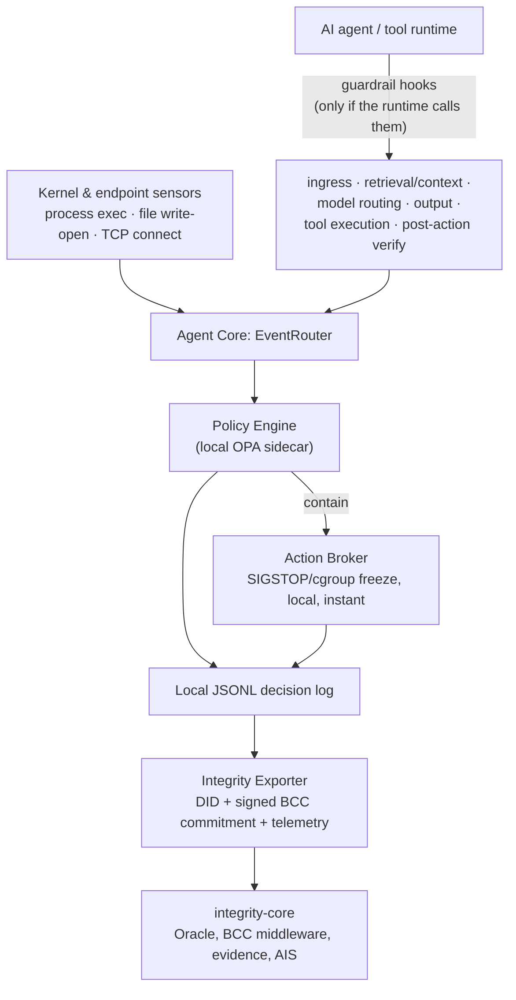

# Xibalba Shield Wiki

Xibalba Shield is a Linux-first endpoint security agent for the age of AI agents: if the most
powerful software running on a device is an agent that can plan, call tools, route to models,
read data sources, and open network paths, endpoint security has to become agent-aware too.
Shield fights fire with fire — local agent-runtime guardrails, kernel-level telemetry,
deterministic policy, and Integrity-backed evidence export, all constraining the agents operating
on the device. It is the local sensor-and-enforcement layer; `integrity-core` is the identity,
BCC, telemetry, scoring, and evidence substrate that receives Shield's signed decisions.
Governance/conventions live in `WIKI_SCHEMA.md`; the full catalog with one-line descriptions is
`WIKI_INDEX.md`; the change history is `WIKI_LOG.md`.

**Start here** if you're new:
[Enforcement Pipeline](architecture/enforcement-pipeline.md) (the end-to-end flow) →
[Policy Engine](concepts/policy-engine.md) (Tier 1, and an important OPA-delegation caveat) →
[Action Broker](concepts/action-broker.md) (real OS-level containment) →
[SLM Cascade Tiers](concepts/slm-cascade-tiers.md) (what's real vs. `[PLANNED]` in the 3-tier
architecture).

## System at a glance

## Pages by category

### Concepts
- [Event Router](concepts/event-router.md)
- [Policy Engine](concepts/policy-engine.md)
- [Action Broker](concepts/action-broker.md)
- [Guardrail Hooks](concepts/guardrail-hooks.md)
- [Integrity Exporter](concepts/integrity-exporter.md)
- [SLM Cascade Tiers](concepts/slm-cascade-tiers.md)
- [Sensor Model](concepts/sensor-model.md)

### Entities
- [Device Context & Agent Registry](entities/device-context.md)
- [Event Log](entities/event-log.md)

### Architecture
- [Ecosystem Role](architecture/ecosystem-role.md)
- [Enforcement Pipeline](architecture/enforcement-pipeline.md)

### Queries
- [Compliance Evidence Trail](queries/compliance-evidence-trail.md)

## Reference

- [WIKI_INDEX.md](WIKI_INDEX.md) — full catalog, one-line description per page
- [WIKI_LOG.md](WIKI_LOG.md) — chronological record of every wiki change, append-only
- [WIKI_SCHEMA.md](WIKI_SCHEMA.md) — page format, frontmatter, tag taxonomy

## No aspirational content

Every page here documents what exists in the code right now. A feature described in a spec or a
README but not yet implemented — or implemented differently than other repository documentation
claims — is stated explicitly, never written as if it matches the more flattering description.
See `WIKI_SCHEMA.md` for the full convention.
